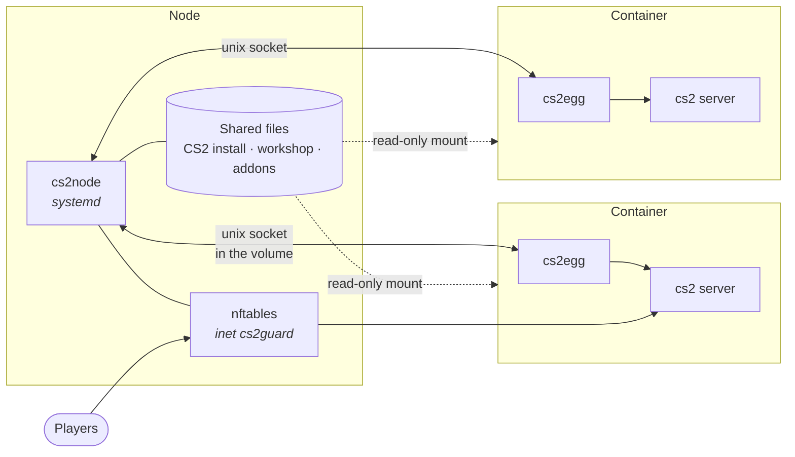

<div align="center">

# KitsuneLab CS2

**Counter-Strike 2 servers for Pterodactyl and Pelican, without a shell script in sight.**

One static binary boots the server inside the container. An optional daemon on the node shares the game files between every server, drops bot floods before they reach a container, and keeps workshop content in one place instead of one copy per server.

[](https://github.com/K4ryuu/CS2-Egg-Go/actions/workflows/ci.yml)
[](https://github.com/K4ryuu/CS2-Egg-Go/releases)
[](LICENSE)

[Documentation](docs/README.md) · [Install](docs/install.md) · [Modules](docs/modules/README.md) · [Migrating from the bash egg](docs/migrating-from-bash.md)

</div>

---

## What it is

Two programs, one repository.

| | Runs | Job |
|---|---|---|
| **cs2egg** | inside the container, as the image entrypoint | Boots the server: configs, SteamCMD, addon updaters, cleanup, console filter, bot guard, then the game itself |
| **cs2node** | on the node, as a systemd service | Shares CS2 files, blocks bot traffic in nftables, caches addons and workshop content, backs servers up, reports crashes |

`cs2node` is optional. A server runs fine without it, the way the old egg always did, and picks up every shared feature the moment a node daemon is there.

## Why

A CS2 install is 35 GB. Twenty servers on a node is 700 GB of the same files, twenty SteamCMD runs after every Valve update, and twenty separate downloads of the same workshop map. Bot floods hit the game port before the server can do anything about them. The egg that solved this in bash grew to 9,700 lines that users edited and broke.

This is that egg rewritten: no shell in the image, JSON config with real validation, and the node side split into modules you switch on one by one.

## Quick start

### The server

1. Panel > Admin > Nests > Import Egg: `https://raw.githubusercontent.com/K4ryuu/CS2-Egg-Go/main/pterodactyl/kitsunelab-cs2-go-egg.json`
2. Create a server on it, or point an existing server's **Docker Image** at `ghcr.io/k4ryuu/cs2-egg-go:stable`.
3. Start it. The console tells you what it is doing at every step.

That is the whole setup. Addon frameworks, the console filter and the bot guard are panel switches.

### The node (optional, root)

```bash
curl -fsSL https://github.com/K4ryuu/CS2-Egg-Go/releases/latest/download/cs2node_linux_amd64 -o /tmp/cs2node
chmod +x /tmp/cs2node && sudo /tmp/cs2node install
```

The wizard asks which modules you want and explains what each one changes. Press Enter through it if you are not sure; the defaults are the tested ones. Then:

```bash
sudo cs2node doctor    # every check, exit 1 on a real problem
sudo cs2node status    # servers, their maps and players, what each module is doing
sudo cs2node top       # live view, like htop for your servers
```

## Modules

Every module is optional and none of them talk to each other, only to the daemon core. A module that fails to start is logged and dropped; the rest keep running.

| Module | What you get | Docs |
|---|---|---|
| `vpksync` | One CS2 install per node instead of one per server, around 52 GB saved each. Servers restart on a Valve update, right away or once they are empty | [VPK sync](docs/modules/vpk-sync.md) |
| `guard` | nftables drops on the game ports before Docker's NAT, fed by the in-game bot detector and by traffic shape | [Guard](docs/modules/guard.md) |
| `workshop` | Maps, models and skins stored once per node and linked into every server, so they stop eating each server's disk quota | [Workshop cache](docs/modules/workshop.md) |
| `addoncache` | One GitHub fetch per node for Metamod, CounterStrikeSharp, SwiftlyS2 and ModSharp, plus version locks for the whole fleet | [Addon cache](docs/modules/addon-cache.md) |
| `alerts` | Crashes, CS2 updates, blocks and backups in a Discord channel | [Alerts](docs/modules/alerts.md) |
| `crashes` | The console tail, the dumps and the addon versions of every crash, bundled outside the volume | [Crash bundles](docs/modules/crashes.md) |
| `backup` | A nightly archive of what you cannot re-download, kept off the server's disk | [Backups](docs/modules/backups.md) |
| `metrics` | `cs2node top` and a Prometheus endpoint | [Metrics](docs/modules/metrics.md) |
| `cleanup` | Demos, logs and crash dumps deleted on a schedule, one rule set for the node instead of one per server | [Cleanup](docs/modules/cleanup.md) |

## How the pieces fit



The socket lives in the server's own volume (`egg/cs2node.sock`). A live connection is the only presence signal there is: no marker files, no timestamps, nothing to go stale.

## Requirements

| | Minimum |
|---|---|
| Panel | Pterodactyl or Pelican, both tested |
| Node OS | Ubuntu 20.04+ or Debian 11+, x86-64 |
| Kernel | 4.18 for the guard, 5.2 for the shared mounts |
| Everything else | Docker, which Wings already gave you |

`cs2node` is a static binary. There is nothing to `apt install`, no `nft`, no `jq`, no Python.

## Documentation

Start at [docs/README.md](docs/README.md). The pages worth reading first:

- [Install a server](docs/install.md) and [install the node daemon](docs/node.md)
- [Migrating from the bash egg](docs/migrating-from-bash.md), including the way back
- [Panel variables](docs/reference/panel-variables.md) and [config files](docs/reference/server-configs.md)
- [CLI reference](docs/reference/cli.md), [node config reference](docs/reference/node-config.md), [error codes](docs/reference/error-codes.md)
- [Architecture](docs/development/architecture.md) if you want to know how it works inside

## Contributing

Bug reports and pull requests are welcome. [CONTRIBUTING.md](.github/CONTRIBUTING.md) has the short version: build it, run `make test`, keep the console output looking the way it does.

## License

GNU General Public License v3 or later, see [LICENSE](LICENSE).

Copyright (C) 2024-2026 Kőrösfalvi "K4ryuu" Martin.

Run it, host with it, change it: none of that asks anything of you. Hand out a modified `cs2egg`, `cs2node`, or an image built from them, and you owe the people you handed it to the source of your changes under the same licence. The bash egg this replaces is MIT and stays that way at [K4ryuu/CS2-Egg](https://github.com/K4ryuu/CS2-Egg) for anyone who needs it.
