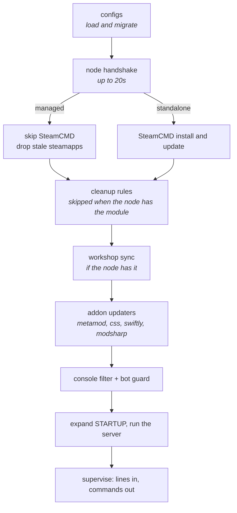
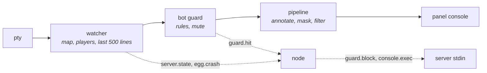
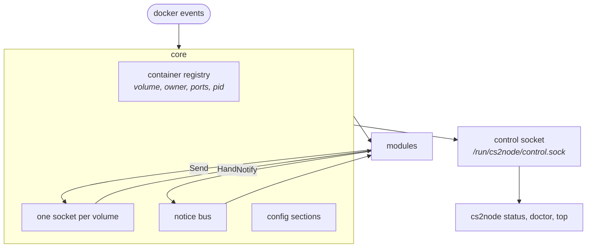

# Architecture

Two binaries, one module, no shared state except a socket.

```
cmd/cs2egg      the image entrypoint
cmd/cs2node     the node daemon and its CLI
internal/
  version/      build stamps, semver compare
  logx/         the console format, levels, coded messages, masking
  config/       JSON load, save, migrate
  netx/         address classification, shared by both sides
  proto/        every message the two sides exchange
  egg/          everything that runs inside a container
  node/         everything that runs on the node
tests/          unit and integration suites, mirroring the source tree
```

## The egg

One process, one boot sequence, then it supervises the game.



Once the server runs, the egg is a pipe with opinions. Every line goes through the same path:



The supervisor owns the pty, the stdin forwarding and the shutdown. One echo per typed command, and `quit` on SIGTERM with a grace period. No `script`, no FIFO, no `tail --pid`.

## The node

A core and modules. The core is the only thing that knows about docker or sockets.



What a module is allowed to see:

```go
type Module interface {
    Name() string
    Describe() string
    Questions() []Question
    Run(ctx context.Context, c *core.Core) error
    Doctor(ctx context.Context, c *core.Core) []doctor.Check
}
```

Three optional interfaces go with it: `Noter` for what the installer should warn about, `Seeder` for config keys the wizard never asks about but the operator has to be able to edit, and `Statuser` for the module's own section of `cs2node status`. A module that implements none of them still works, it just has nothing to say in those places.

And what the core gives it: the running containers, a subscription to lifecycle events, `Send` and `Handle` for one server's egg, its own config section, a notice bus, and a status provider for the CLI. Nothing else. Two modules cannot reach each other even if they wanted to.

The CLI talks to the running daemon over a root-only control socket that serves one snapshot. That is why `cs2node status` is instant and never disturbs a push.

## Why a socket and not files

The bash version kept state in marker files and timestamps: a server checked whether a file existed, whether it was recent enough, whether a boot id matched. Every one of those is a race, and half the bugs came from there.

A connection is either open or it is not. The egg connects, both sides say hello, and the node knows this exact boot of this exact server is listening right now. When the connection drops, the presence is gone with it, immediately, with nothing to clean up. A status message only counts if it arrives on the connection the egg opened after its own hello, so a stale answer cannot be replayed.

## Deep modules, small seams

The rule the code follows: a lot of behaviour behind a small interface.

| Module | Interface | Hides |
|---|---|---|
| `egg/guard` | feed a line, get actions | Seven rule types, client state machine, mute, cooldown, self-test |
| `egg/supervisor` | `Run(ctx)` | pty, echo handling, stdin forwarding, graceful shutdown |
| `node/core` | containers, events, send, handle | docker API, socket lifecycle, reconnects |
| `node/guard` | block, unblock, judge | nftables over netlink, 21 rules, escalation, kernel log reading |
| `config` | `Load(path, defaults)` | Schema versions, named-array merging, atomic writes |

The test suites hang off those same seams, which is why they are fast and why a refactor inside a module does not break them.

## Where the state lives

| State | Where | Survives |
|---|---|---|
| Server config | The volume, `egg/configs/*.json` | Everything |
| Node config | `/etc/cs2node/config.json` | Daemon updates |
| Blocks | The kernel, nftables sets with timeouts | Daemon restarts |
| Offenders, for escalation | `/var/lib/cs2node/guard/offenders.json` | Reboots |
| Shared CS2 install | `/srv/cs2-shared` | Everything |
| Workshop store | `/srv/cs2-workshop`, keyed by item and version | Everything |
| Crash bundles, backups | Their own directories, outside the volumes | The server being wiped |
| Everything else | Memory | Nothing, deliberately |

## Reading the code

Start at `cmd/cs2node/main.go` for the node: it wires the modules and dispatches, with the command bodies in `commands.go` and `status.go` next to it. For the egg, `internal/egg/boot/boot.go` is the whole boot sequence in one readable function, in order.

---

[Docs index](../README.md)
