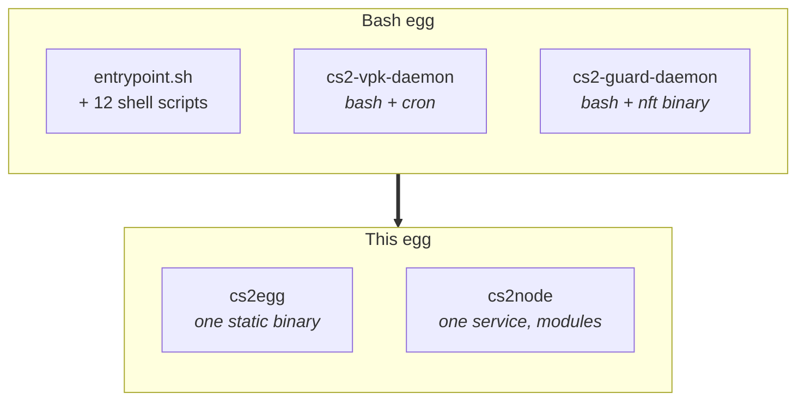

# Migrating from the bash egg

The old [KitsuneLab CS2 egg](https://github.com/K4ryuu/CS2-Egg) and this one can live side by side in the same panel and on the same node. Different egg, different image, different daemon. So you can move one server, watch it for a day, and move the rest when you are happy.

Your server data is untouched by all of this. Configs, plugins, maps and the CS2 install stay where they are.

## What changes



| Before | Now |
|---|---|
| `entrypoint.sh` and a dozen scripts in the image | One binary, no shell in the image |
| Two bash daemons plus two cron jobs | One systemd service with modules |
| State in marker files and timestamps | A unix socket in the volume; a live connection is the signal |
| `nft` binary, parsed with awk | Netlink directly, no `nft` needed |
| Settings spread across scripts | `/etc/cs2node/config.json`, validated on load |

Same console format, same colours, same `KL-` codes. That part was deliberate.

## What stays

- `egg/configs/*.json` on every server. They are read, migrated in place, and keep your rules.
- `egg/versions.txt`, so the addon updaters know what is installed.
- `/srv/cs2-shared`, the shared CS2 install. The new daemon uses the same directory.
- `/root/steamcmd`.

## Moving a server

1. Import the new egg (see [install](install.md)).
2. On the server, switch **Docker Image** to `ghcr.io/k4ryuu/cs2-egg-go:stable`.
3. If the panel offers to change the egg, point it at **KitsuneLab CS2 Go**. The variables have the same names, so nothing to retype.
4. Restart.

The console should look familiar. If the node daemon is not installed yet, the server runs standalone with its own SteamCMD, exactly like the old one did without its daemons.

## Moving the node

Do this with the servers stopped, or at least expect one restart each.

### 1. Stop the bash daemons

They fight over the same shared directory, so they go first.

```bash
sudo systemctl disable --now cs2-vpk-daemon cs2-guard-daemon
sudo rm -f /etc/systemd/system/cs2-vpk-daemon.service /etc/systemd/system/cs2-guard-daemon.service
sudo systemctl daemon-reload
sudo rm -f /etc/cron.d/cs2-update /etc/cron.d/cs2-guard /etc/logrotate.d/cs2-guard
sudo rm -f /usr/local/bin/update-cs2-centralized.sh /usr/local/bin/guard-cs2-centralized.sh
```

Old logs and state, once you no longer want them:

```bash
sudo rm -rf /var/log/cs2-update.log /var/log/cs2-guard.log /var/log/cs2-guard-rates.log /var/lib/cs2-guard
```

Keep `/srv/cs2-shared` and `/root/steamcmd`.

### 2. Install cs2node

```bash
curl -fsSL https://github.com/K4ryuu/CS2-Egg-Go/releases/latest/download/cs2node_linux_amd64 -o /tmp/cs2node
chmod +x /tmp/cs2node && sudo /tmp/cs2node install
```

Point `vpksync` at the same `/srv/cs2-shared` and it picks up the existing install: no 35 GB download. The guard replaces the old nftables table on its first start.

### 3. Restart the servers

They need one restart to pick up the new image and to meet the daemon.

```bash
sudo cs2node doctor
sudo cs2node status
```

### Settings that moved

| Bash | Now |
|---|---|
| `CS2_DIR` in the update script | `modules.vpksync.cs2_dir` |
| `PUSH_METHOD` | `modules.vpksync.push_method` |
| `MAX_WORKERS` | `modules.vpksync.max_workers` |
| `AUTO_RESTART` | `modules.vpksync.auto_restart`, plus a restart policy the bash version did not have |
| `UDP_PPS_LIMIT` and the other guard tunables | `modules.guard.*`, same names in snake case |
| `QUIET_RULES` | `modules.guard.quiet_rules` |
| Cron schedules | `check_minutes` on the module that does the work |

`cs2node install` writes all of it for you; the table is here for anyone who tuned the bash scripts by hand and wants the same numbers back. Full list: [node config](reference/node-config.md).

## Going back

Nothing here is one-way.

**One server:** set its **Docker Image** back to the old egg's image and restart. If the node daemon manages its files, run `sudo cs2node workshop sync <server>` first only if you want its workshop content back as real files; otherwise the server downloads what it needs again.

**The node:**

```bash
sudo cs2node uninstall        # keeps the config in case you come back
sudo nft delete table inet cs2guard
```

Then reinstall the bash daemons from the old repository. `/srv/cs2-shared` is in the layout both versions expect, so the old update script picks it up as it left it.

**What you lose on the way back:** the workshop cache leaves symlinks in the volumes pointing at `/tmp/cs2-workshop`, which will not exist any more. Before uninstalling, hand the files back:

```bash
sudo cs2node workshop sync      # every stopped server
```

Stop the servers first, or do it one at a time with the server stopped. Every server then holds its own real copies again, and nothing depends on the node.

## Running both at once

Common during a migration, and fine:

- Two eggs in the panel, two images, servers on either.
- On the node, only one daemon at a time. The Go one manages the containers whose image matches `modules.images`, which by default is only the new image, so bash-egg servers are left alone.
- The old bash daemons must be off. Two programs pushing into the same volume is the one thing that actually breaks.

---

[Docs index](README.md)
