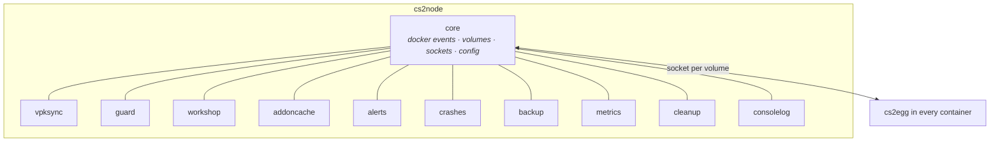

# Modules

`cs2node` is a small core plus modules. The core knows about containers, their volumes and the socket to each server's egg. Everything else is a module that asks the core for what it needs.

Modules never talk to each other. A module that fails to start is logged, dropped from what the daemon advertises to servers, and the rest keep running.

## Picking modules

| Module | Costs | Gives |
|---|---|---|
| [vpksync](vpk-sync.md) | 40 GB on the node, once | ~52 GB back per server, one SteamCMD run per node, controlled restarts on Valve updates |
| [guard](guard.md) | Kernel 4.18+ | Bot floods dropped before they reach a container |
| [workshop](workshop.md) | Disk for one copy of each addon | Maps and models stop counting against every server's quota, and download once |
| [addoncache](addon-cache.md) | A few hundred MB | No GitHub rate limits on mass restarts, and version locks for the fleet |
| [alerts](alerts.md) | A Discord webhook | Crashes, updates and blocks in a channel |
| [crashes](crashes.md) | Disk for the bundles | The console tail and dumps of a crash, kept after the server restarted |
| [backup](backups.md) | Disk for the archives | A nightly copy of what you cannot re-download |
| [metrics](metrics.md) | A local port | `cs2node top` and Prometheus |
| [cleanup](cleanup.md) | Nothing | Demos, logs and dumps deleted on a schedule, one rule set for the node, off the server boot path |
| [consolelog](console-log.md) | Disk for the log files | Every server's console tab, saved past a restart, gzip-compressed after a day |

Turn one on any time: `sudo cs2node install` walks the list again with your current settings as the defaults.

## How a module gets its work

Three ways, and nothing else:

1. **Container events.** The core watches docker and tells modules when a server starts or stops. That is when `vpksync` mounts the shared directory and `workshop` prepares its links.
2. **The egg asks.** A server's boot pauses at a few points to ask the node: is my CS2 install yours, what is the current Metamod release, sort my workshop content. `cs2egg` waits up to 20 seconds for a node and then goes on without one.
3. **A timer.** `vpksync` checks for a CS2 update, `workshop` asks Steam which items moved on, `backup` runs at its hour.

## Notices

One module produces a fact, others consume it, and neither knows about the other. A crash notice comes from the socket, and `crashes` bundles it while `alerts` posts it.

| Notice | Raised by |
|---|---|
| `crash` | A server's egg reporting a real crash |
| `cs2.update` | `vpksync` when the central build changed |
| `push.failed` | `vpksync` when a volume could not be updated |
| `restart.deferred` | `vpksync` when a restart waits for an empty server |
| `guard.block` | `guard` on every address it drops |
| `backup.done`, `backup.failed` | `backup` |
| `node.update` | The self-updater |
| `server.start`, `server.stop` | The core |

`alerts` subscribes to the ones you picked. Anything else that wants them can subscribe too.

## Config

Every module has a section in `/etc/cs2node/config.json` under `modules`, and every section has an `enabled` flag. The wizard writes them; you can edit the file and restart the daemon instead.

Keys, defaults and what they do: [node config reference](../reference/node-config.md).

---

[Docs index](../README.md)
