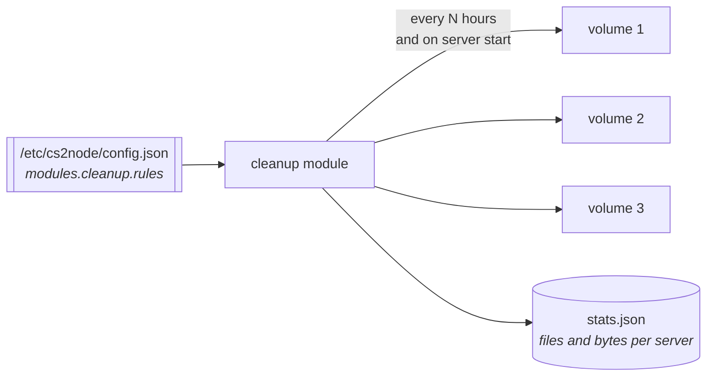

# Cleanup

Demos, plugin logs, crash dumps and core files pile up until a server hits its disk limit. The egg has deleted them by rule since the bash days, but it did that at boot, in the server's own startup path, out of a config file that lives inside each volume. Twenty servers meant twenty copies of the same rules and twenty boots waiting on a directory walk.

This module moves that work to the node: one rule set for the whole fleet, on a schedule, off the boot path.

## What changes for a server

When the node runs this module, the egg skips its own boot-time pass and says so at debug level. A server with no node, or a node without this module, keeps using its own `egg/configs/cleanup.json` exactly as before. Nothing is lost either way.



## Commands

```bash
sudo cs2node cleanup              # what the passes removed, per server and per rule
sudo cs2node cleanup <server>     # one server, with its own rule breakdown
sudo cs2node cleanup now          # force a pass over every running server
sudo cs2node cleanup now <server> # force a pass over one
```

`cs2node status` carries a short version: when the next pass is, how much has been freed in total, and the last pass per server.

## Settings

| Key | Default | What it does |
|---|---|---|
| `every_hours` | `6` | Hours between passes. `0` means only when a server starts |
| `on_start` | `true` | Also clean when a container comes up, which is what the egg used to do |
| `keep_open` | `true` | Leave files the server still holds open |
| `rules` | the egg's eight | The rule set, written into the config at install so it is editable in one place |

### Why `keep_open` matters

Deleting a file the server still has open frees nothing. Linux unlinks the name, the process keeps writing through its open descriptor, and the blocks stay allocated until the server restarts. The file disappears from `ls` while the quota does not move, which looks exactly like a bug.

So the module reads `/proc/<pid>/fd` for the container and leaves those paths alone. They are counted as skipped and shown in the output. Set `keep_open` to `false` if you would rather delete them anyway and accept that the space comes back on the next restart.

## Rules

A rule is the same shape the egg's `cleanup.json` has always used:

```json
{
  "name": "demos",
  "description": "SourceTV demo recordings",
  "directories": ["./game/csgo"],
  "patterns": ["*.dem"],
  "hours": 168,
  "recursive": true,
  "enabled": true
}
```

| Field | Meaning |
|---|---|
| `name` | The category in the output and the stats |
| `directories` | Where to look, relative to the volume root. `.` is the root itself |
| `patterns` | Basename globs: `*.dem`, `core.[0-9]*` |
| `hours` | Only files older than this. `0` deletes on every pass |
| `recursive` | Walk subdirectories, default true |
| `delete_parent_dir` | Delete the matched file's whole parent folder, for per-crash bundles |
| `enabled` | `false` parks a rule without deleting it |

The defaults cover match backup rounds, demos, CounterStrikeSharp and SwiftlyS2 logs, SwiftlyS2 crash reports and prevention logs, AcceleratorCS2 dumps, and Linux core dumps.

## Safety

Every path is resolved inside an `os.Root` opened on the volume, so a rule, or a symlink someone planted in a volume, cannot reach a file outside it. An absolute path is refused at config load unless it names the volume root itself, which is how an older `cleanup.json` wrote `/home/container`.

Symlinks are never followed and never counted as the file they point at. `delete_parent_dir` never deletes the rule's own root directory, and never a directory that still holds subdirectories, so a bundle folder goes and a container folder does not.

---

[Docs index](../README.md)
