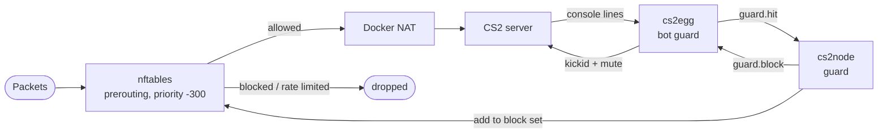

# Guard

Two halves of one thing. Inside the container, the egg reads the server console and recognises clients that behave like bots. On the node, the daemon turns those reports into packet drops in nftables, before Docker's NAT, on the game ports only.

Either half works alone. The egg can kick and ban by itself; the node can drop traffic that never reaches a server. Together the egg says who, and the node makes it stop costing you bandwidth.



## Switching it on

On each server, panel variable `ENABLE_GUARD` = `1`. On the node, enable the `guard` module.

Leave the egg's `action` on `log` when the node has the module: the node does the blocking, the egg only reports and mutes the client's remaining console lines. Without a node, set `action` to `kick` or `block` in `egg/configs/guard.json` so the egg acts on its own, or set the panel's `GUARD_ACTION` variable, which overrides the file when set without needing to open it. `ban_minutes`, the default block length a `kick`/`block` action uses, has the same panel override: `GUARD_BAN_MINUTES`.

## What the egg catches

Seven rules, all in `egg/configs/guard.json`, all editable. Each has a threshold, a window, a ban length and its own `enabled` and `log` flags.

| Rule | Trips on | Threshold | Ban |
|---|---|---|---|
| `reconnect_stuck` | `Forcing client reconnect` for the same name | 3 in 15 s | 6 h |
| `move_not_joined` | move messages from a client that never joined | 5 in 15 s | 6 h |
| `stray_no_connection` | `Stray data packet from host with no connection` | 4 in 10 s | 30 m |
| `connect_flood` | `Receiving C2S_CONNECT` from one address | 6 in 10 s | 30 m |
| `rcon_bruteforce` | the engine banning an address for rcon attempts | 1 in 10 s | 24 h |
| `malformed_packet` | `Invalid lead/length byte` | 2 in 10 s | 24 h |
| `stuck_no_full` | keepalives from a client that never reaches full signon | 3 in 10 s | 1 h |

A client that finished signon is trusted and exempt from the traffic-shaped rules. It is never exempt from `rcon_bruteforce` or `malformed_packet`.

Whitelists, also in `guard.json`:

```json
{
  "whitelist_ips": ["203.0.113.5"],
  "whitelist_steamids": ["76561198000000000"]
}
```

Or the panel's `GUARD_WHITELIST_STEAMIDS` and `GUARD_WHITELIST_IPS`, comma-separated lists that override the file's `whitelist_steamids` and `whitelist_ips` when set, no need to open `guard.json` for a quick addition.

## What the node catches

The egg only sees what reaches the server. The node sees the wire, and that is where the rest of the defence lives.

**Static rules**, always on, no reports needed:

| Rule | Drops |
|---|---|
| tiny packets | UDP shorter than 17 bytes, the classic amplification probe |
| per-source flood | more than `udp_pps_limit` packets a second from one address |
| rcon SYN flood | more than `rcon_syn_per_minute` connection attempts a minute |
| A2S and TCP shaping | rate limited, never blocked, because the source is easy to fake |

**Heuristics**, from the traffic of clients that did join:

| Check | Looks for |
|---|---|
| idle | a joined client whose packets are too few or too small to carry player input |
| chatbot | a client that chats within `chat_early_secs` of joining with the traffic shape of a bot |

Both need the egg connected, because only the egg knows who joined and when.

## Blocks

Every block has a timeout and every repeat within `repeat_window_hours` gets longer: the second one is four times the first, the third is the maximum. `max_ban_minutes` caps it, a week by default, because an address that trips the guard three times in a day is not a player having a bad evening. Manual blocks never escalate.

Blocks survive a daemon restart. They live in the kernel, not in the process.

```bash
sudo cs2node blocks              # ip, ban, time left, hits, why
sudo cs2node why 203.0.113.7     # everything the node knows about one address
sudo cs2node block 203.0.113.7 60
sudo cs2node unblock 203.0.113.7
sudo cs2node unblock all
sudo cs2node rates 10            # packets/s and bytes/packet per source
```

Private addresses and the Docker bridge are refused: `172.18.0.1` fronts every proxied client, and blocking it would block everyone.

### Where the reason comes from

Every block the daemon applies is recorded with its reason in `/var/lib/cs2node/guard/offenders.json`, and that record is kept for as long as the block lasts, across daemon restarts. The rates log is only a fallback for blocks made before this, because a log rotates and a rotated line cannot be asked afterwards.

One case is left where nobody can say why:

| Says | Means |
|---|---|
| `not logged` | A static nftables rule dropped it and the kernel never logged it. The `tiny` rule's log line is limited to 30 a minute for the whole node, and a flood from many addresses passes that in its first second, so most of those blocks are silent |
| `older than this log` | Recorded before the daemon kept reasons, and the rates log has since rotated past it |
| `no rates log yet` | `rates_log` is empty in the config, or the daemon has not written to it yet |

The drop is real in every case. `cs2node why <ip>` adds the recorded reason, the offender history, the kernel log and the daemon journal for that address.

## In the server console

Detections and node blocks print with their own level, so they stand out:

```
KitsuneLab | GUARD | [KL-GRD-01] Bot-guard tripped 'connect_flood' from 203.0.113.7 (action=log, block 30m)
KitsuneLab | GUARD | [KL-GRD-05] Host guard dropped 203.0.113.7 for 30m (connect_flood, egg)
```

After a block the client's remaining lines are muted, so a bot cannot spam the console on its way out. `KL-GRD-03` means the egg could not verify that it can type into the server console, so a `kick` or `block` action might not land. See [error codes](../reference/error-codes.md).

## Tuning

Start with `block_mode` on `log` for a day. The node logs what it would have blocked, and `/var/log/cs2node/guard-rates.log` records every sample. If nothing in there is a real player, turn it to `enforce`.

The knobs that matter most, in `modules.guard`:

| Key | Default | Raise it when |
|---|---|---|
| `udp_pps_limit` | 1500 | Real players get dropped on a busy 128-tick server |
| `idle_pps_max` | 15 | A legitimate spectator client looks idle |
| `chat_early_secs` | 10 | Players who chat the second they join get caught |
| `max_ban_minutes` | 10080 | You want a different ceiling than a week for repeat offenders |

Full list: [node config](../reference/node-config.md#guard).

## What it never touches

Only the game ports of the CS2 containers, in its own nftables table named `cs2guard`. SSH, the panel, Wings and every other service are untouched. Uninstalling leaves the table so nobody gets un-banned by accident; `nft delete table inet cs2guard` clears it.

---

[Docs index](../README.md)
