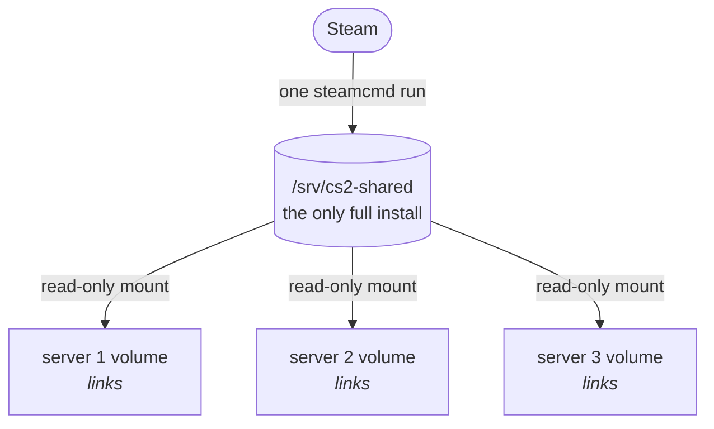

# VPK sync

A CS2 install is about 35 GB, and every server holds its own copy. This module keeps one install on the node and gives every server access to it, so a server volume holds a few hundred megabytes instead of 35 gigabytes.

It also runs the update. SteamCMD runs once per node, not once per server, and the servers restart onto the new build on a schedule you choose.



## How a server gets the files

At boot the egg asks the node whether its game files are managed. If they are, it skips SteamCMD entirely and reports what the node is doing:

```
KitsuneLab | RUN   | Checking for daemon-managed game files...
KitsuneLab | RUN   | Waiting for the node: 2 server(s) ahead in queue
KitsuneLab | RUN   | Node is verifying game files...
KitsuneLab | OK    | Daemon-managed game files, SteamCMD skipped
```

No node, or the node says it failed? The egg falls back to its own SteamCMD and boots normally. That path is tested, not theoretical: it is what every server does before you install the daemon.

## Delivery methods

| `push_method` | How | Disk per server | Needs |
|---|---|---|---|
| `symlink` | The central directory is bind-mounted read-only into the container, VPKs become links into it | Almost nothing | Kernel 5.2+ |
| `hardlink` | Same inodes, no second copy on the filesystem | Nothing on the host, but the panel counts it against the server | Same filesystem |
| `copy` | A real copy per server | Full size | Works anywhere |

`symlink` is the default and the reason this module exists. The others are there for kernels and filesystems that cannot do it.

What a push never touches: `game/csgo/gameinfo.gi`, `game/csgo/cfg/`, `steamapps/`, `Steam/`, and the ownership of anything already in the volume. Your configs are yours.

## Updates and restarts

The node checks the installed build against Steam every `check_minutes`. When Valve ships an update it runs SteamCMD once, pushes the new files into every volume, and then decides when each server restarts:

| `restart_policy` | Restarts |
|---|---|
| `immediate` | Right after the push, players or not |
| `empty` | The moment nobody is on, or after `max_delay_hours` |
| `window` | The moment nobody is on, or inside `restart_window`, or after `max_delay_hours` |

A forced restart warns the players through the console first:

```
say Server restarts in 5 minute(s) for a CS2 update
say Server restarts in 2 minute(s) for a CS2 update
say Restarting now for a CS2 update
```

The player count comes from the egg reading the console, so there is no query traffic and no dependency on a plugin. A server on an older image reports nothing and restarts immediately.

`cs2node status` shows `restart pending` next to a server whose restart is being held.

## Commands

```bash
sudo cs2node status     # push state per server, central build id
sudo cs2node doctor     # the install, the disk, steamcmd, the Wings API, every server
journalctl -u cs2node -f
```

## Wings restarts

The restart goes through the Wings API, which means Wings does it properly instead of the container being killed. The daemon reads the token from `/etc/pterodactyl/config.yml` or `/etc/pelican/config.yml` and pins Wings' own certificate, so a self-signed cert is fine and a wrong one is refused.

## Config

`modules.vpksync` in `/etc/cs2node/config.json`. Every key: [node config](../reference/node-config.md#vpksync).

## Troubleshooting

**`shared dir not mounted`** on a server: kernel older than 5.2, or the daemon was not running when the container started. Restart the server; on an old kernel switch `push_method` to `copy`.

**A server fell back to SteamCMD**: `cs2node doctor` reports `steamapps/` in the volume. The next boot with the node up cleans it out again.

**Cross-filesystem hardlink**: `cs2_dir` and the volumes are on different partitions. Move the directory or use `copy`.

---

[Docs index](../README.md)
