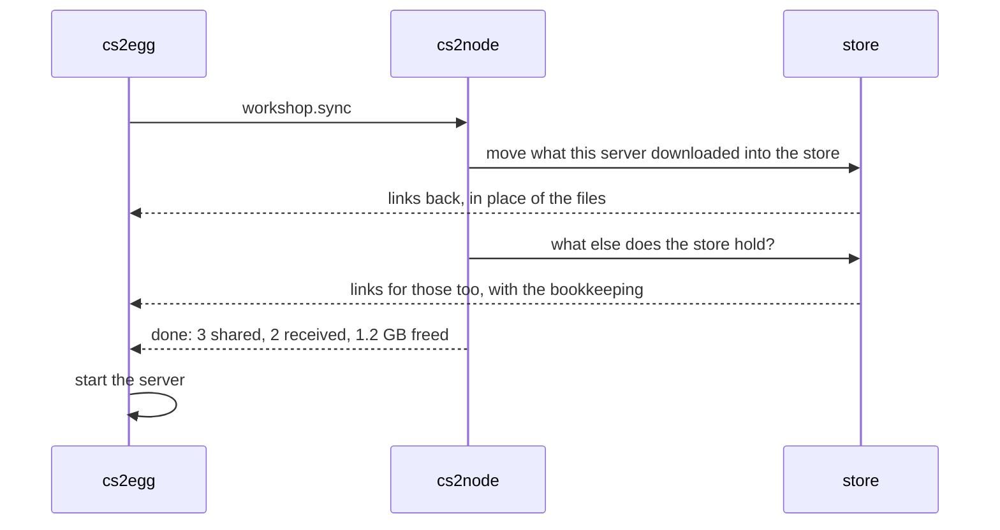

# Workshop cache

A workshop item costs its full size in every server that mounts it, and every server downloads it separately. Maps are only part of that: model packs, skins and sound replacements come from the same workshop, and plugins like [MultiAddonManager](https://github.com/Source2ZE/MultiAddonManager) or SwiftlyS2's [AddonsManager](https://github.com/SwiftlyS2-Plugins/AddonsManager) mount a whole list per server.

This module keeps one copy per node and links it into every server, the same way [VPK sync](vpk-sync.md) handles the game files. Three maps on one test server came to 692 MiB; twenty servers sharing them would be 13 GiB and nineteen pointless downloads.

## Where the content lives

Everything goes through the game's own Steam client, so it all lands in one place:

```
game/bin/linuxsteamrt64/steamapps/workshop/
  content/730/<id>/<id>.vpk              small items
  content/730/<id>/<id>_dir.vpk          bigger ones, plus numbered chunks
  appworkshop_730.acf                    which version of each item is installed
```

The module treats an item's whole directory as the unit, so multi-chunk addons work.

## What happens at boot



1. Items the server downloaded itself move into the node's store and come back as links.
2. Items the store already holds arrive as links, with the matching `appworkshop_730.acf` entries, so the server never downloads them. Turn this off with `seed: false`.
3. An item whose author published a new version is handed back as real files, so the server can update it the normal way.

All of it happens before the game process starts. A running server is never reshaped under its feet.

## When an addon updates

The node asks Steam every `check_minutes` which version is current, and it also reads the server's own bookkeeping: when the engine records that a newer version exists, it is about to fetch it.

Then exactly one server does the downloading:

1. The next server to boot with that item gets real files back and updates them itself.
2. On its next boot the node takes the new version over, stored beside the old one.
3. Every other server stops being out of date the moment the store has the new version. They are relinked to it on their next boot, bookkeeping and all, and download nothing.

The old version stays until no server links to it, then `keep_days` and `cs2node workshop prune` clear it.

## Commands

```bash
sudo cs2node workshop                # cached items: size, version, how many servers share each
sudo cs2node workshop sync           # run the pass for every stopped server
sudo cs2node workshop sync <server>  # one server
sudo cs2node workshop prune          # drop versions nothing links to
```

`sync` refuses a running server: its engine holds the files open, so the swap waits for the next boot.

## Legacy items

Some workshop items predate Source 2 and carry no version id; the game records `-1` for them. There is nothing to compare against Steam, so the module leaves them with the server that downloaded them rather than guessing. `cs2node workshop` lists them as `legacy, not versioned`.

## Plugin settings that fight it

Both addon managers can be told to re-download an item on every mount, even one that is already installed:

- MultiAddonManager: `mm_addon_mount_download 1`
- AddonsManager: `RedownloadAddonOnMount`

Leave those off. They throw the sharing away, and a re-download while the server is running has nowhere to write.

## Config

`modules.workshop` in `/etc/cs2node/config.json`. Keep `dir` on the same filesystem as the server volumes: then taking an item over is a rename, instant, instead of a copy. Every key: [node config](../reference/node-config.md#workshop).

No Steam account is needed anywhere. The node shares what a server already downloaded and asks Steam's public API which version is current.

---

[Docs index](../README.md)
