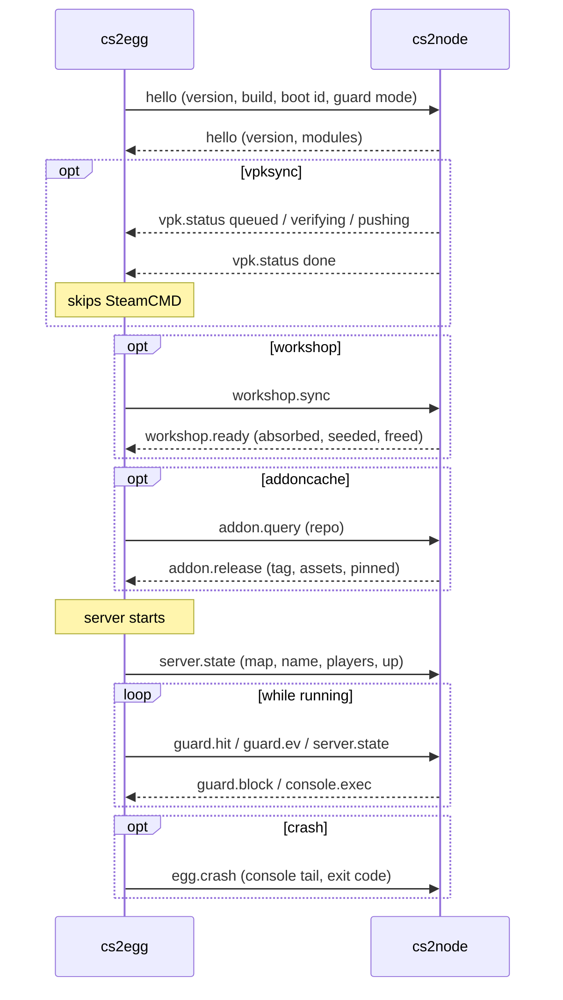

# Protocol

The egg and the node talk over a unix socket in the server's own volume. One JSON object per line, each wrapped in a small envelope.

```
<volume>/egg/cs2node.sock      on the node
/home/container/egg/cs2node.sock   inside the container
```

The node listens, the egg connects. A live connection is the only presence signal: no marker files, no timestamps, nothing that can go stale or be replayed.

## The envelope

```json
{"t": "vpk.status", "v": 1, "d": {"state": "done"}}
```

`t` is the message type, `v` the envelope version, `d` the payload. An unknown type is skipped, not an error, so an older egg and a newer node still understand each other for everything they share.

Lines are capped at 1 MiB, which only matters for a crash report carrying console output.

## A boot, end to end



## Messages

From the egg:

| Type | Carries |
|---|---|
| `hello` | Egg version, build stamp, boot id, whether the bot guard is on and in which mode |
| `guard.hit` | A rule tripped: address, rule, ban length, client id |
| `guard.ev` | A client joined, left or chatted. The node's heuristics run on these |
| `server.state` | Current map, the name players see, player count, whether the process is up. Sent on every change, on every reconnect, and every 30 seconds |
| `egg.crash` | Exit code, the last console lines, the map and players at the time |
| `addon.query` | A GitHub repo, or one file URL to fetch |
| `workshop.sync` | Please reshape my workshop content before I start |

From the node:

| Type | Carries |
|---|---|
| `hello` | Node version and the list of enabled modules |
| `vpk.status` | `queued` with a position, `updating`, `verifying`, `pushing`, `done` or `failed` |
| `guard.block` | An address was dropped for this server: address, minutes, rule, whether it was a dry run |
| `console.exec` | A command to type into the server console |
| `addon.release` | Tag, assets and whether the version is pinned |
| `workshop.ready` | What the workshop pass did |

## Trust

The socket belongs to the container user, and a plugin inside the container can write anything to it. So the node treats every message as the server owner's word:

- Map names and player counts are clamped before they are stored or shown.
- Block requests must name a public address. Private and bridge addresses are refused.
- Addon queries only resolve to GitHub and the .NET CDN.
- Crash reports are rate limited, one bundle per server per minute.
- Everything the node writes into a volume goes through a path-restricted root that refuses to follow a symlink out of it.

More: [security model](../security.md).

## Without a node

The egg waits up to 20 seconds for a socket at boot. No socket means no node, and it boots standalone: its own SteamCMD, its own addon downloads, the bot guard acting on its own. Every feature degrades to what the server can do alone.

If the daemon restarts, the egg reconnects on its own and re-sends its state.

---

[Docs index](../README.md)
